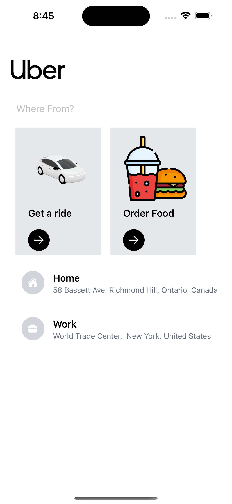
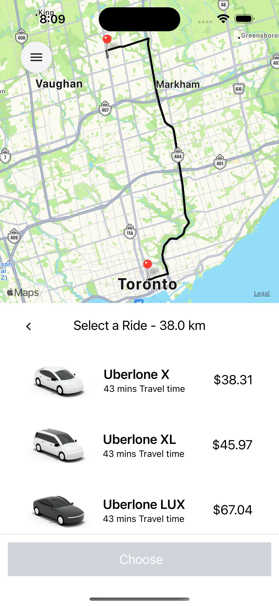

# Uberlone React Native - Uber Clone

## How to start from this template?

You can follow [this guide](https://reactnative.dev/docs/environment-setup) to setup your environment.

Just make sure that you initialize your project like so:

```bash
$ npx react-native init MyAwesomeProject --template https://github.com/arash-esfandiari/uberlone.git
```

To start, enter the following command in the root directory:

```bash
$ npx expo start
```

## What you need to run

Here's a list of what this template provides.

### Google API Key

-   You will need your custom Google API Key set up in an .env in the root directory.
-   The format should be as follows: GOOGLE_MAPS_APIKEY=\*\*\*

## Images



